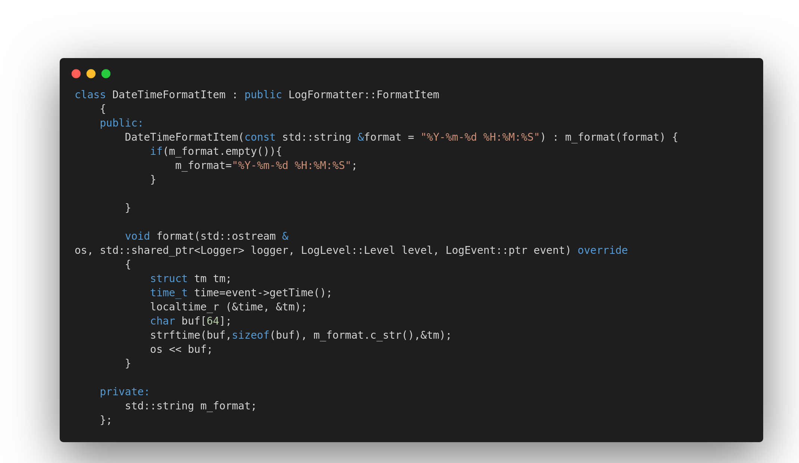
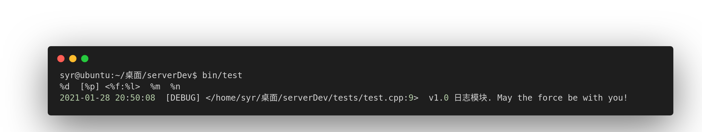

## 日志模块
### 问题记录
包含bug、一些c++11特性的使用
#### log.h
#### log.cpp
##### 1.在成员函数中使用自身智能指针
##### 2.functional使用
##### 3.默认值的重复定义
声明和定义时参数默认值不能重复定义。待查。
##### 4.const与引用返回  类型的初始值设定项时，限定符被丢弃
 std::stringstream& getSS() {return m_ss;}
 函数加const报错
##### 5.不打印日志
原因： LogAppender的m_level没被初始化，日志等级获取的是随机值，可能不大于最低要求等级，因此不打印日志结果
##### 6.日期格式
代码如下：

##### 7.注意命名空间
##### 8.参数中三个.  va_list

##### 9.shared_ptr reset的含义及使用 待查

### v1.0
输出如下：

上半部分为格式，下半部分为日志结果。
### v2.0
增加TabFormatItem 
增加LogEventWrap
增加宏定义
增加文件util.h util.cc singleton.h